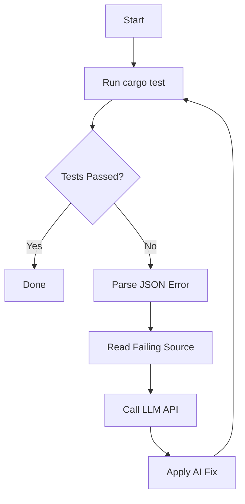

# 🔥 Project Phoenix: The Self-Healing Repo


**Project Phoenix** is an autonomous Rust agent that monitors your codebase, detects failing tests, and uses an LLM to automatically engineer and apply fixes. It transforms your repository into a "living" entity that evolves and repairs itself.

---

## 🚀 How it Works

1.  **Detection:** The agent runs `cargo test` and captures detailed failure data (file, line number, stack trace).
2.  **Diagnosis:** It extracts the failing source code and sends it to an AI backend (Ollama/Llama3 by default) with the error context.
3.  **Repair:** The AI generates a corrected version of the file.
4.  **Verification:** The agent applies the fix and re-runs the tests to ensure the problem is solved.
5.  **Persistence:** Successful fixes are logged in `phoenix_stats.json` and the README badge is updated.

---

## 🛠️ Installation & Usage

### Prerequisites
- [Rust](https://rustup.rs/)
- [Ollama](https://ollama.ai/) with the `llama3` model installed.

### Setup
1. Clone your repo.
2. Ensure Ollama is running: `ollama run llama3`.
3. Run the Phoenix Agent:
   ```bash
   cargo run
   ```

---

## 🧠 System Architecture



---

## 📊 Self-Healing History
Check `phoenix_stats.json` for a detailed log of every file fixed by the agent, including timestamps and the original errors.

---

## 📜 License
MIT
